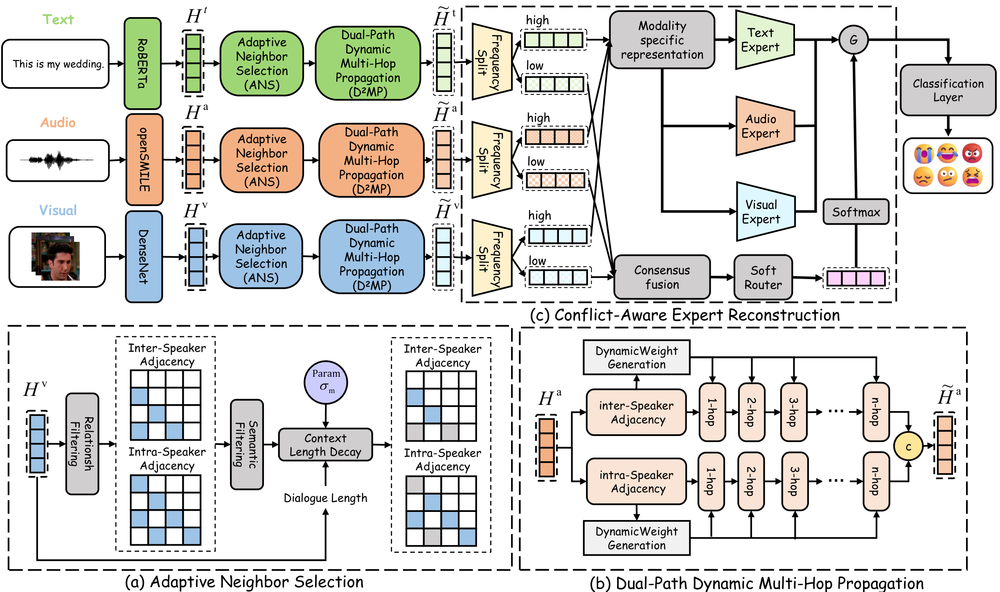

# CDCP — Conflict-Aware Dual-Path Context Propagation for Multimodal Emotion Recognition in Conversation

**Accepted at the 34th ACM International Conference on Multimedia (ACM MM 2026)**

Code for the paper. Training & evaluation pipeline for multimodal emotion recognition.

## Model Architecture



## Project Structure

```
├── train.py              # Training entry point
├── eval.py               # Evaluate a saved checkpoint
├── model.py              # Transformer backbone, attention diffusion, semantic graph
├── MOE.py                # MoMKE module (frequency splitter, expert blocks, gating)
├── dataloader.py         # IEMOCAP / MELD dataset classes
├── exec_meld.sh          # Training launcher for MELD
├── exec_iemocap.sh       # Training launcher for IEMOCAP
├── requirements.txt      # Python dependencies
├── data/                 # Preprocessed feature files (.pkl)
└── README.md
```

## Requirements

```bash
pip install -r requirements.txt
```

## Training

```bash
# Single run
python train.py --lr 5e-6 --batch-size 16 --epochs 50 --temp 8 \
    --Dataset 'MELD' --steps 5 --thera_hidden_dim 128 \
    --MOE_depth 3 --lambd 0.6 0.7 0.8 1.0 0.4 --seed 65256 \
    --checkpoint_dir checkpoints

# Using launcher scripts
bash exec_meld.sh     # MELD experiments
bash exec_iemocap.sh  # IEMOCAP experiments
```

### Key Arguments

| Argument | Default | Description |
|----------|---------|-------------|
| `--lr` | 1e-4 | Learning rate |
| `--batch-size` | 16 | Batch size |
| `--epochs` | 100 | Number of epochs |
| `--dropout` | 0.5 | Dropout rate |
| `--hidden_dim` | 1024 | Hidden dimension |
| `--n_head` | 8 | Attention heads |
| `--temp` | 1 | Temperature |
| `--Dataset` | IEMOCAP | `IEMOCAP` or `MELD` |
| `--steps` | 3 | Attention diffusion steps |
| `--thera_hidden_dim` | 64 | Hidden dim for θ-MLP |
| `--MOE_depth` | 4 | Number of expert blocks |
| `--lambd` | [1,1,1,1,1] | Loss weights `[ℓ_all, ℓ_t, ℓ_a, ℓ_v, ℓ_o]` |
| `--seed` | 51061 | Random seed |
| `--checkpoint_dir` | ./checkpoints | Directory to save checkpoints |
| `--tensorboard` | False | Enable TensorBoard logging |

## Checkpoints

During training, two `.pt` files are saved per run under `{checkpoint_dir}/{Dataset}/`:

- `best_seed_{seed}.pt` — updated whenever test F1 reaches a new best
- `last_seed_{seed}.pt` — saved after the final epoch

Each checkpoint contains:

| Field | Description |
|-------|-------------|
| `model_state_dict` | Model weights |
| `optimizer_state_dict` | Optimizer state |
| `epoch` | Epoch at save time |
| `best_fscore` | Best weighted F1 |
| `best_test_acc` | Best test accuracy |
| `args` | Full command-line arguments |

## Evaluation

Use `eval.py` to load a saved checkpoint and reproduce test results:

```bash
python eval.py --checkpoint checkpoints/MELD/best_seed_65256.pt
```

Sample output:
```
Loaded checkpoint: checkpoints/MELD/best_seed_65256.pt
Dataset : MELD
Seed    : 65256
Best F1 : 66.84
Best Acc: 68.12

============================================================
  Test Accuracy : 68.12
  Test F-Score  : 66.84
============================================================

              precision    recall  f1-score   support
  ...
```

## Citation

If you use this code or find our work helpful, please cite:

```bibtex
@inproceedings{cdcp2026,
  title     = {Conflict-Aware Dual-Path Context Propagation for Multimodal Emotion Recognition in Conversation},
  author    = {},
  booktitle = {Proceedings of the 34th ACM International Conference on Multimedia (MM '26)},
  year      = {2026},
  publisher = {ACM},
  doi       = {}
}
```

## License

Academic research purposes only.
